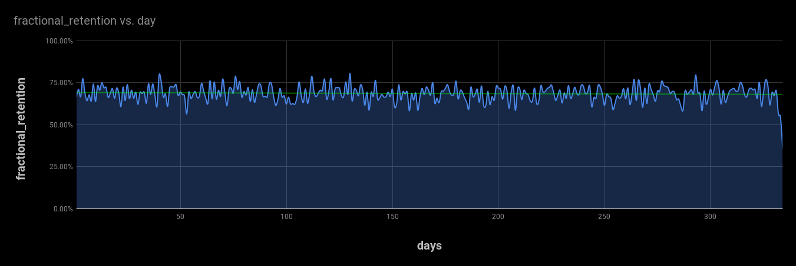
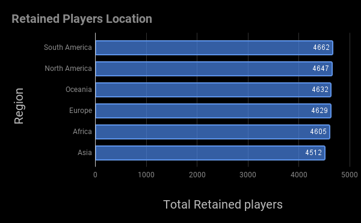

# **Project 1: Analyzing Data with SQL and Sheets**
### ***Rolling Retention Analysis for a Mobile Game Company***
___
___

## **Purpose of the Project**
___
The purpose of this project is to analyze a relational database of a mobile gaming company using complex SQL queries. The data is to be aggregated and then utilized to create a visualization using Google sheets. This game has a store where players can buy a vast array of different items. Matches are composed of two players going head-to-head against each other. We have four tables as part of our dataset:

- Match information, including the players who matched against each other, and the outcome,
- Player information, including information like the player's age and when they joined,
- Item information, including the item ID and the price, and
- Purchase information, including what player ID bought what item ID, and on what day.

Below is how the first row of each table looks like :

##### 1. **item_info**

item_id | price
---------|----------------
35d02644f8f74e818546a6803600dd8a    |   2.0

##### 2. **matches_info**

player_id | match_id |opponent_id|outcome|day
---------|-----------|-----------|-------|---
650cf321ff3e4dec8d247854d62f0604 | a226a425199c4494bd2a5fca48d85ea9|	e2cdc18efc534b4bb740d14aa45d5f7a |	win |	1

##### 3. **player_info**

player_id|	location|	age|	system |	joined
---------|-----------|-----------|-------|---
49d65bd7b1bd4d398e4bb67fe6fb6082 |	Asia|	8|	Linux|	104

##### 4. **player_info**

player_id |	item_id |	day
---------|-----------|-----------
a2850b5e0b054d0a97338c14d0fd8338	| 54c53d6ef25c4f94af77e48c75f7e802 |	1

## **How are we going to do it?**
___
Using SQL queries, we are going to create a table that will show 30 days `Rolling Retention`.
The table will have the total no. of players joined and retained on a particular day. Which will then be transformed to calculate a `Fractional Retention` *(total retained players divided by total players joined that day)*

Then we will use this information to answer some questions to come up with useful insights into our data:

- **Question 1** : Do players with rolling 30-day retention spend more?
- **Question 2** : Do players with rolling 30-day retention come from specific regions?

We will create visualization graphs using Google Sheets to show the answer to the above questions.

## **SQL Queries Process**
***

- **Query1** : On the `player_info` table, data is aggregated to get the total number of players who joined on a given day.

- **Query2** : On `matches_info` we aggregate data on player_id to get the most recent/last day of play.

- **Query3** : Now, we join both the tables above to get the joining_day and lastplay day of each player.

- **Query4** : This query is run on the above data to add a column that check each player for the `condition of rolling retention` and puts a number **1** for `retained` and **0** for `unretained players`,

- **Query5** : This query aggregates the data above over day and counts total players joined that day and total players retained the same day.

- **Query6** : Now for our final step, we divide the total retention players by the total no. of players joined that day to get `Fractional Retention`.

#### Do players with rolling 30-day retention spend more?

- **Query7** : To answer this, first we will join `purchase_info` and `item_info` tables and will aggregate player_id to get the sum of the total amount spent by each player

- **Query8** : Using the table from query 4 we will join it with the table above.

- **Query9** : Finally we aggregate the data over the `player_status` to find the sum of the amount spent by retained and unretained players and compare it.

#### Do players with rolling 30-day retention come from specific regions?

- **Query10**: To answer this question, we are again using query 4 filtering the data for retained players and then joining it with `player_info` table to get aggregated location-specific retention data for players.

# **Visualization (using Google Sheets)**
---

## Is 30-day rolling retention increasing or decreasing over the lifecycle of the game?

#### The above graph shows that the retention rate is moving at an average rate of approximately 70%. The Second year data is not available yet, hence we can ignore the slight inclination of the trend line towards a downward trend because of a steep fall in the retention rate at the end. Also please note that the retention rate of the last 30 days of the year are not included in the graph above as our condition for rolling retention can not test for rolling retention of players within the last 30 days of the year as the data for the second year is not available yet.

## Do players with rolling 30-day retention spend more?

#### The graph above shows that the Retained players have mode more purchases and tends to be generating more revenue for the company as compared to the unretained players.

## - Do players with rolling 30-day retention come from specific regions?

[Interactive Map](https://docs.google.com/spreadsheets/d/e/2PACX-1vQds7rdOcerXl_oG0XWF6HIQCmd9GEL-Ou2NvTJGzMhSkLRaTBnDn_F4FZib4qWaBm7ARLIWkGTbeQ9/pubchart?oid=1597236594&format=interactive)

#### The data above shows that the most players with rolling 30-day retention come from **South America.**

# **Project Repository Files**
---

- ## *queries.txt*
This file has the combined form of all the queries mentioned above in form of three complex queries to aggregate data and to answer all the 3 Questions.

- ## *project_sql_queries.ipynb*
This jupyter notebook provides a step-by-step breakdown of all the queries and their results.

- ## *retentionrate_graph.png*
This file is created from Google sheets on the retained table to create a graph to show retention visualization and the chart is then downloaded as a png file.

- ## *amount_spent.png*
This file is created from Google sheets from the data from our query to create a graph to show the total amount spent by retained and unretained player's visualization and the chart is then downloaded as a png file.

- ## *locations.png*
This file is created from Google sheets on our final query table to create a graph to show the location of retained players visualization and the chart is then downloaded as a png file.
